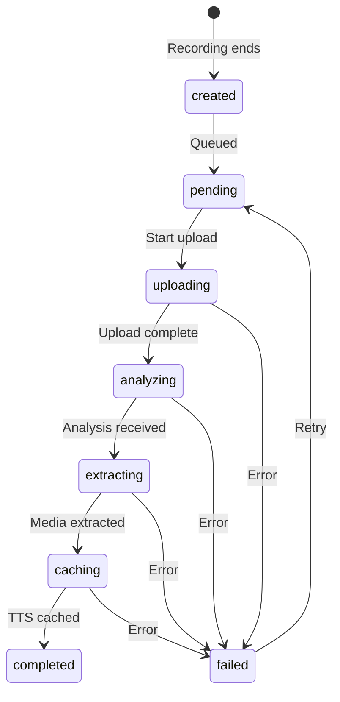

# Video Analysis Flow

## Overview

This document describes the complete flow for storing, uploading, and analyzing golf swing videos in the FutureGolf iOS app after recording completes. The system uses a clean service-based architecture with clear separation of concerns.

## Architecture

### Core Components

#### 1. SessionAnalysisModel
The single source of truth for a complete analysis session.

```swift
struct SessionAnalysisModel: Codable {
    let id: String                        // Unique identifier (timestamp: "yyyy-MM-dd-HHmmss")
    let createdAt: Date                   // When analysis was created
    var status: SessionAnalysisStatus     // Current processing status
    
    // Media References
    var videoPath: String?                // Relative path to video file
    var thumbnailPath: String?            // Relative path to thumbnail
    var keyframePaths: [String: String]   // Phase name -> relative path
    var coachingTTS: [CoachingTTSItem]   // TTS phrases with audio paths
    
    // Analysis Data
    var analysisResult: SessionAnalysisResult?   // Result from API (see below)
    var lastError: String?                // Last error if failed
    var uploadProgress: Double             // Upload progress (0.0-1.0)
    var lastUpdated: Date                 // Last status change
    
    // Processing Metadata
    var retryCount: Int                   // Number of retry attempts
    var serverAnalysisId: String?         // Server-side analysis ID
}

struct CoachingTTSItem: Codable {
    let phrase: String                    // The text that was synthesized
    let audioPath: String                 // Relative path to the audio file
    let startFrameNumber: Int?            // Optional frame number for synchronization
}

enum SessionAnalysisStatus: String, Codable {
    case created       // Initial state after recording
    case pending       // Waiting for upload
    case uploading     // Currently uploading
    case analyzing     // Server processing
    case extracting    // Extracting media (keyframes, etc)
    case caching       // Caching TTS audio
    case completed     // Fully processed
    case failed        // Processing failed
}

// Analysis result from backend API
struct SessionAnalysisResult: Codable {
    let swings: [SwingAnalysis]
    let summary: SessionAnalysisSummary
    let coachingScript: CoachingScript
}

struct SwingAnalysis: Codable {
    let score: Int                    // 1-100 score for the swing
    let phases: SwingPhases           // Frame numbers for each phase
    let comments: [String]            // Improvement suggestions
}

struct SwingPhases: Codable {
    let setup: PhaseFrames
    let backswing: PhaseFrames
    let downswing: PhaseFrames
    let followThrough: PhaseFrames   // "follow_through" in JSON
}

struct PhaseFrames: Codable {
    let startFrame: Int               // "start_frame" in JSON
    let endFrame: Int                 // "end_frame" in JSON
}

struct SessionAnalysisSummary: Codable {
    let highlights: [String]          // Positive aspects
    let improvements: [String]        // Suggested improvements
}

struct CoachingScript: Codable {
    let lines: [CoachingLine]
}

struct CoachingLine: Codable {
    let text: String                  // Text to be spoken via TTS
    let startFrameNumber: Int         // "start_frame_number" in JSON
}
```

### Primary Services

#### 2. SessionAnalysisPersistenceService
Manages all persistence operations for analysis sessions.

**Responsibilities:**
- Save/load SessionAnalysisModel instances
- Manage file system structure
- Store media files (video, thumbnails, keyframes, TTS audio)
- Maintain analysis index

**File Structure:**
```
Documents/
└── SwingAnalyses/
    ├── index.json                    # Index of all analysis sessions
    └── 2025-01-02-143022/            # Session folder (ID is timestamp)
        ├── model.json                # SessionAnalysisModel data
        ├── media/
        │   ├── video.mp4             # Original video
        │   ├── thumbnail.jpg         # Video thumbnail
        │   └── keyframes/
        │       ├── 001.jpg
        │       ├── 002.jpg
        │       └── 003.jpg
        └── audio/
            ├── tts_0.mp3             # Coaching line 0
            └── tts_1.mp3             # Coaching line 1
```

**Key Methods:**
```swift
class SessionAnalysisPersistenceService {
    // Create new analysis session
    func createAnalysis(videoURL: URL) -> SessionAnalysisModel
    
    // Save/update model
    func save(_ model: SessionAnalysisModel) throws
    
    // Load model
    func load(id: String) -> SessionAnalysisModel?
    
    // List all analysis sessions
    func listAnalyses() -> [SessionAnalysisModel]
    
    // Save media files
    func saveVideo(id: String, from: URL) throws -> String
    func saveThumbnail(id: String, image: UIImage) throws -> String
    func saveKeyframe(id: String, phase: String, image: UIImage) throws -> String
    func saveTTSAudio(id: String, index: Int, data: Data) throws -> String
    
    // Delete analysis and all files
    func delete(id: String) throws
    
    // Get file URLs
    func getVideoURL(for model: SessionAnalysisModel) -> URL?
    func getThumbnailURL(for model: SessionAnalysisModel) -> URL?
}
```

#### 3. SessionAnalysisCoordinatorService
Orchestrates the entire analysis workflow for a session.

**Responsibilities:**
- Coordinate analysis pipeline
- Communicate with API
- Orchestrate media extraction
- Coordinate TTS caching
- Update model status throughout

**Workflow:**
```swift
class SessionAnalysisCoordinatorService {
    private let persistence: SessionAnalysisPersistenceService
    private let mediaExtractor: MediaExtractionUtil
    private let ttsCoordinator: TTSCoordinatorService
    private let apiClient: APIClient
    
    // Main processing method
    func processAnalysis(_ model: SessionAnalysisModel) async throws {
        // 1. Upload video
        var updatedModel = model
        updatedModel.status = .uploading
        try persistence.save(updatedModel)
        
        let result = try await uploadVideo(model)
        
        // 2. Update with results
        updatedModel.status = .analyzing
        updatedModel.serverAnalysisId = result.id
        try persistence.save(updatedModel)
        
        // 3. Wait for analysis
        let analysis = try await waitForAnalysis(result.id)
        updatedModel.analysisResult = analysis
        updatedModel.status = .extracting
        try persistence.save(updatedModel)
        
        // 4. Extract media
        let keyframes = try await extractKeyframes(model, analysis)
        updatedModel.keyframePaths = keyframes
        updatedModel.status = .caching
        try persistence.save(updatedModel)
        
        // 5. Cache TTS
        let ttsItems = try await cacheTTS(model, analysis)
        updatedModel.coachingTTS = ttsItems
        
        // 6. Mark complete
        updatedModel.status = .completed
        try persistence.save(updatedModel)
    }
    
    // Cancel processing
    func cancelProcessing(id: String)
    
    // Retry failed analysis
    func retryAnalysis(id: String) async throws
}
```

### Supporting Services

#### 4. MediaExtractionUtil
Handles all video frame extraction operations.

```swift
class MediaExtractionUtil {
    // Extract thumbnail at specific time
    func extractThumbnail(from videoURL: URL, at time: Double = 0) async -> UIImage?
    
    // Extract multiple keyframes
    func extractKeyframes(from videoURL: URL, at times: [Double]) async -> [UIImage]
    
    // Get video duration
    func getVideoDuration(url: URL) async -> Double?
}
```

#### 5. TTSCoordinatorService
Manages TTS phrase caching for analyses.

```swift
class TTSCoordinatorService {
    private let ttsService: TTSService
    
    // Register all phrases from analysis
    func registerAnalysisPhrases(_ analysis: SessionAnalysisResult)
    
    // Cache phrases and return TTS items with paths
    func cachePhrases(for analysis: SessionAnalysisResult) async -> [CoachingTTSItem]
    
    // Check if all phrases cached
    func areAllPhrasesCached(for analysis: SessionAnalysisResult) -> Bool
    
    // Monitor caching progress
    func monitorCachingProgress(for analysisId: String) -> AsyncStream<Double>
}
```

#### 6. SessionAnalysisQueueManager
Manages the queue of pending analysis sessions and coordinates with connectivity.

```swift
class SessionAnalysisQueueManager {
    private let persistence: SessionAnalysisPersistenceService
    private let coordinator: SessionAnalysisCoordinatorService
    private let connectivity: ConnectivityService
    private var activeTasks: Set<Task<Void, Never>> = []
    
    init() {
        // Register for connectivity changes
        connectivity.addDelegate(self)
    }
    
    // Add to queue
    func enqueue(analysisId: String)
    
    // Process all pending
    func processPendingAnalyses() async
    
    // Get queue status
    func getQueueStatus() -> (pending: Int, processing: String?)
    
    // Cancel all processing
    func cancelAll()
}

extension SessionAnalysisQueueManager: ConnectivityDelegate {
    func connectivityRestored() {
        Task { await processPendingAnalyses() }
    }
    
    func connectivityLost() {
        cancelAll()
    }
}
```

## Analysis Flow

### Step 1: Recording Completion
When recording ends in `RecordingScreen`:
```swift
// 1. Save video and create analysis
let model = persistenceService.createAnalysis(videoURL: tempVideoURL)

// 2. Extract and save thumbnail immediately
if let thumbnail = await mediaExtractor.extractThumbnail(from: tempVideoURL) {
    let path = try persistenceService.saveThumbnail(id: model.id, image: thumbnail)
    model.thumbnailPath = path
    try persistenceService.save(model)
}

// 3. Navigate to analysis view
navigationPath.append(AnalysisRoute(id: model.id))

// 4. Queue for processing
queueManager.enqueue(analysisId: model.id)
```

### Step 2: Analysis Processing
The `SessionAnalysisQueueManager` processes the queue:
```swift
func processPendingAnalyses() async {
    let pending = persistence.listAnalyses()
        .filter { [.created, .pending, .failed].contains($0.status) }
        .sorted { $0.createdAt < $1.createdAt }
    
    for analysis in pending {
        guard connectivityService.isConnected else { break }
        
        do {
            try await coordinator.processAnalysis(analysis)
        } catch {
            // Handle error, update retry count
        }
    }
}
```

### Step 3: Status Updates
Throughout processing, the model status is updated:


### Step 4: UI Updates
The `SessionAnalysisViewModel` observes model changes:
```swift
class SessionAnalysisViewModel: ObservableObject {
    @Published var model: SessionAnalysisModel?
    @Published var thumbnail: UIImage?
    @Published var isLoading: Bool = true
    
    private let persistence: SessionAnalysisPersistenceService
    
    func load(id: String) {
        // Load model
        model = persistence.load(id: id)
        
        // Load thumbnail
        if let model = model, let url = persistence.getThumbnailURL(for: model) {
            thumbnail = UIImage(contentsOfFile: url.path)
        }
        
        // Update UI based on status
        isLoading = model?.status != .completed
    }
}
```

## Connectivity Handling

### When Connection Lost
1. `ConnectivityService` detects loss
2. `SessionAnalysisQueueManager.connectivityLost()` called via delegate
3. All active upload tasks cancelled
4. Status of uploading items reset to `pending`
5. UI shows "Waiting for connectivity..."

### When Connection Restored
1. `ConnectivityService` detects restoration
2. `SessionAnalysisQueueManager.connectivityRestored()` called via delegate
3. Queue manager starts `processPendingAnalyses()`
4. Processes oldest analyses first

## App Launch Processing

```swift
// In FutureGolfApp.swift
func performAppInitialization() {
    // Check for pending analyses
    let queueManager = deps.analysisQueueManager
    let status = queueManager.getQueueStatus()
    
    if status.pending > 0 && ConnectivityService.shared.isConnected {
        Task {
            await queueManager.processPendingAnalyses()
        }
    }
}
```

## Error Handling

Each service handles errors appropriately:

1. **Persistence Errors** → Mark as failed, store error message
2. **Network Errors** → Retry with exponential backoff
3. **Media Extraction Errors** → Continue with partial media
4. **TTS Errors** → Mark as complete but without audio

## Testing

### Unit Tests
Each service can be tested independently:
- Mock dependencies for isolated testing
- Test error conditions
- Verify state transitions

### Integration Tests
Test the complete flow:
1. Create analysis from video
2. Process through pipeline
3. Verify all media extracted
4. Verify TTS cached
5. Verify final state

## Benefits of This Architecture

1. **Separation of Concerns** - Each service has a single responsibility
2. **Testability** - Services can be tested in isolation
3. **Maintainability** - No file exceeds 350 lines
4. **Flexibility** - Easy to modify individual components
5. **Clarity** - Clear data flow and dependencies

## Migration Path

1. Create `SessionAnalysisModel` struct
2. Implement `SessionAnalysisPersistenceService`
3. Implement supporting services
4. Implement `SessionAnalysisCoordinatorService`
5. Refactor `SwingAnalysisViewModel` to use services
6. Remove old `AnalysisStorageManager` and `AnalysisMediaStorage`
7. Update `AppDependencies` with new services
